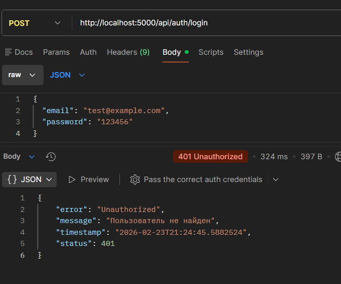
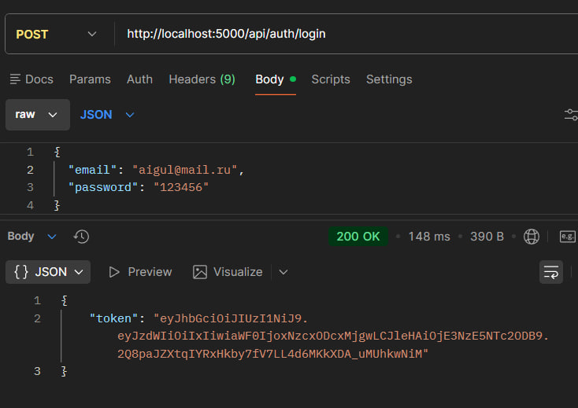
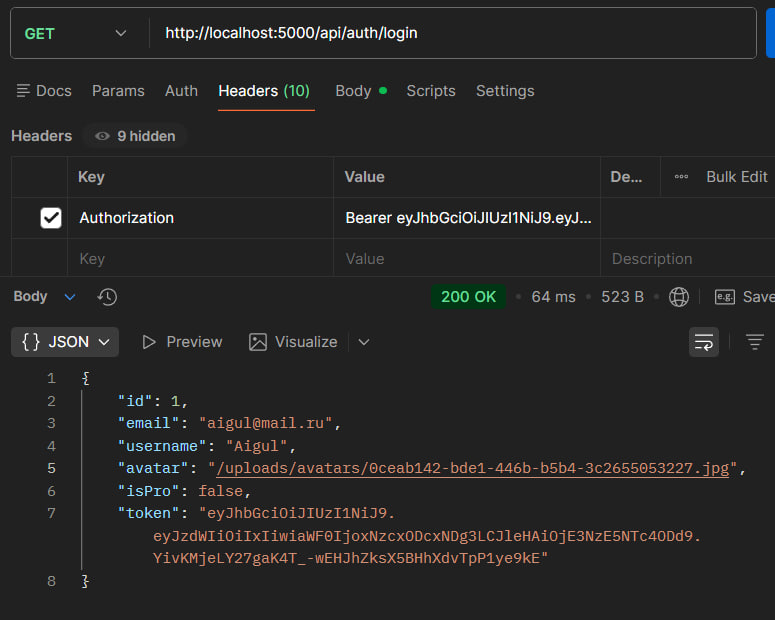
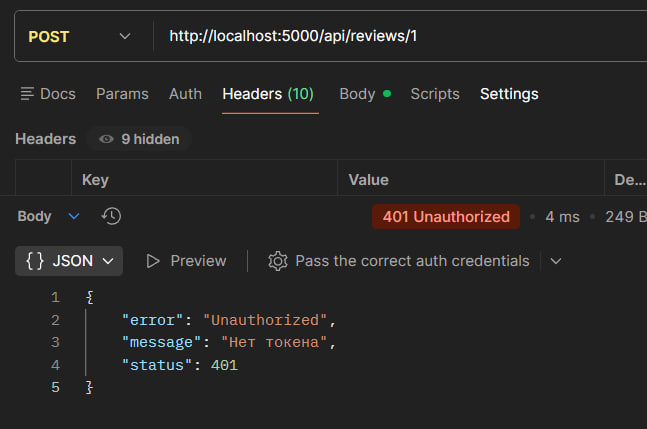
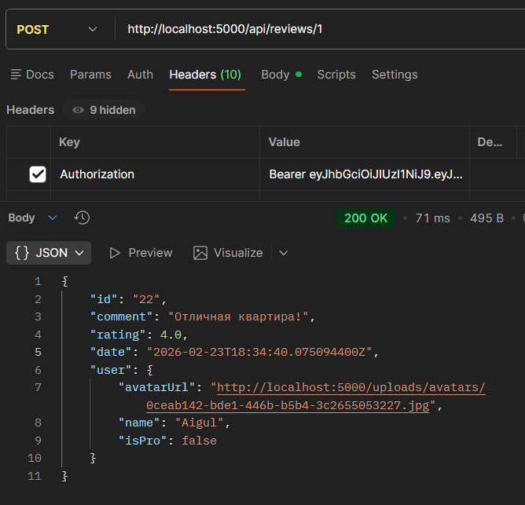
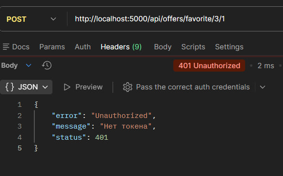
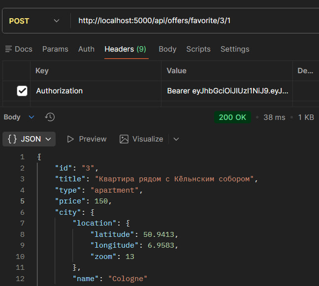
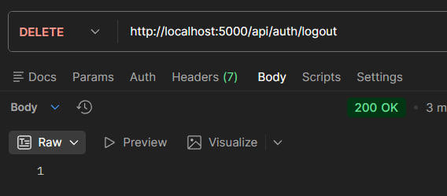

# Лабараторная работа 3
# Задание 1
## Добавление нового комментария

## Получение списка комментариев к предложению

# Задание 2 
## Получение списка предложений в избранном

## Добавление / удаление предложения в/из избранное

# Задание 3
## Логин и получение токена

## Проверка статуса аутентификации

## Проверка защиты маршрута добавления отзыва

## Проверка защиты добавления/удаления избранного

## Logout

