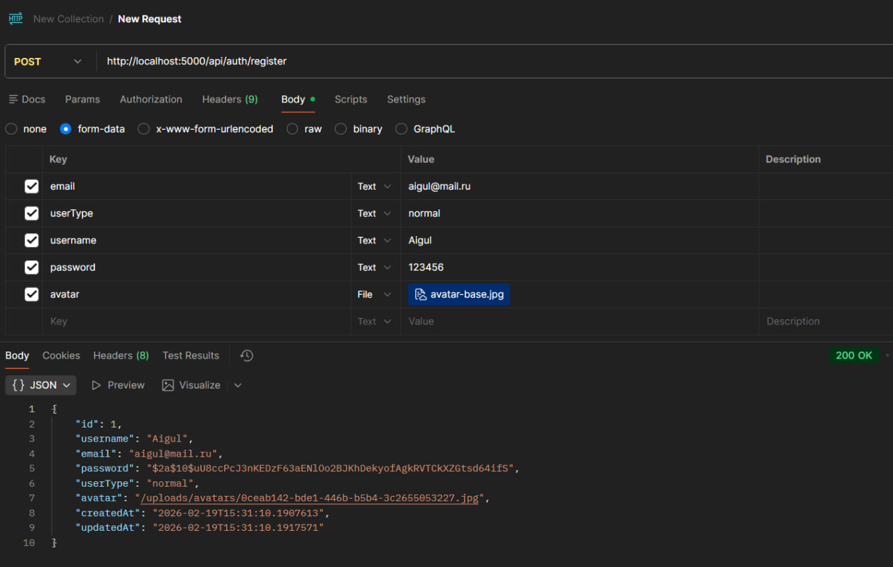
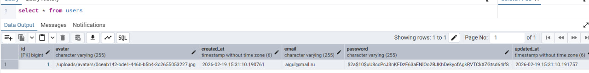
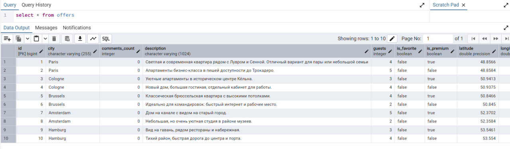
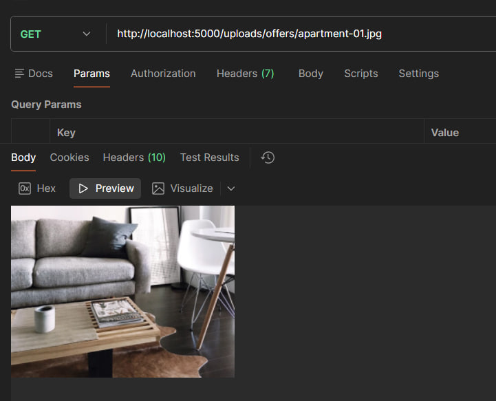
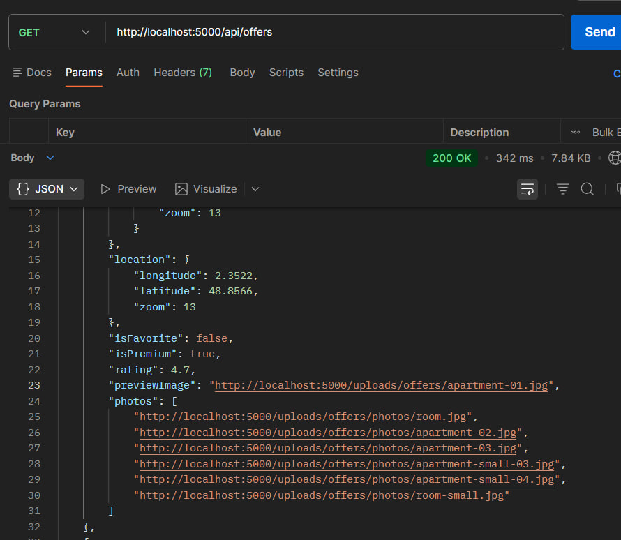
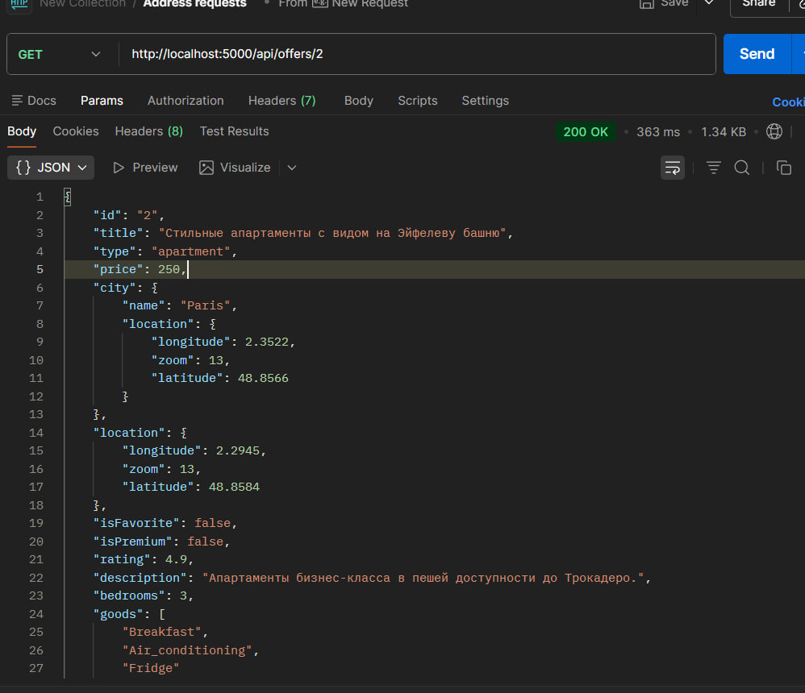
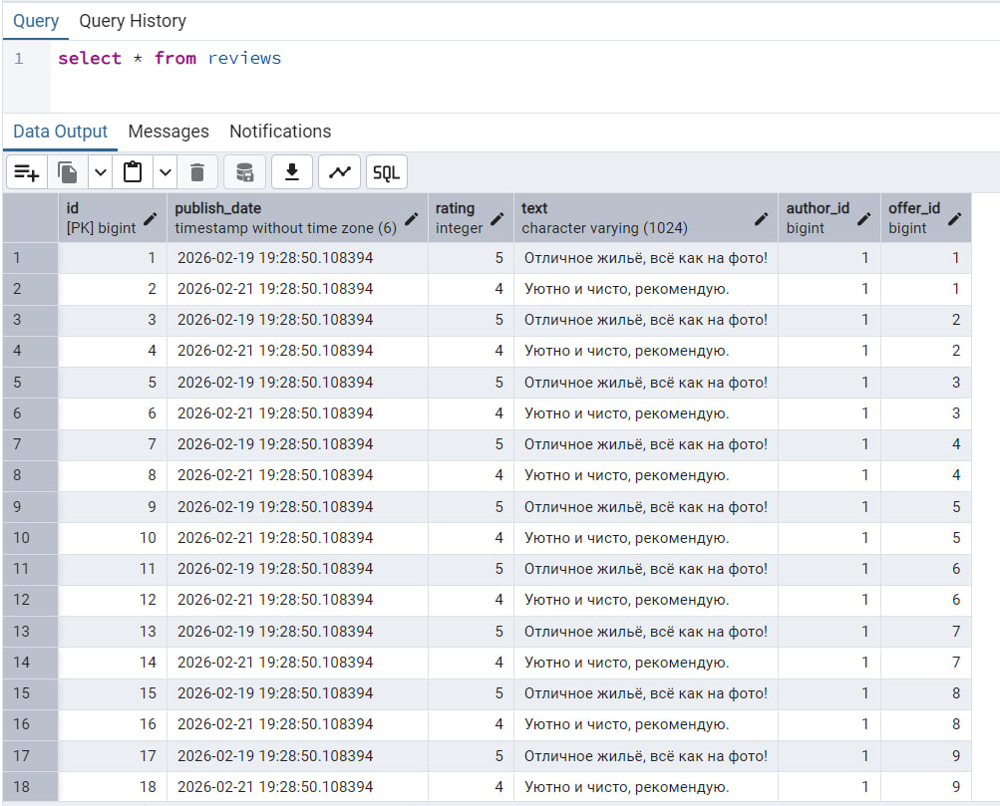

# Лабараторная работа 2
## Задание 3 - Регистрация пользователя

## Задание 4 - Создание предложения по аренде

## Задание 5 - Доработка функции getOffers()

## Задание 5 - Доработка функции getOffers()

## Задание 6

## Задание 7

