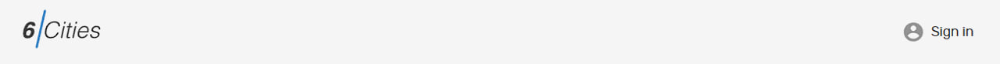
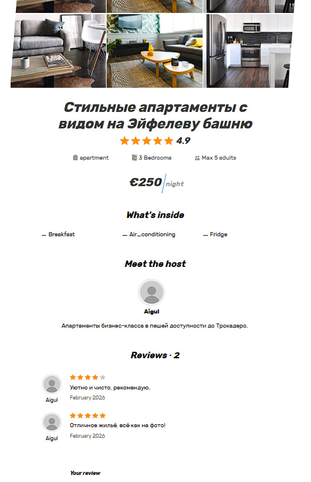
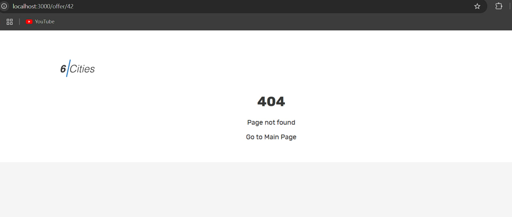
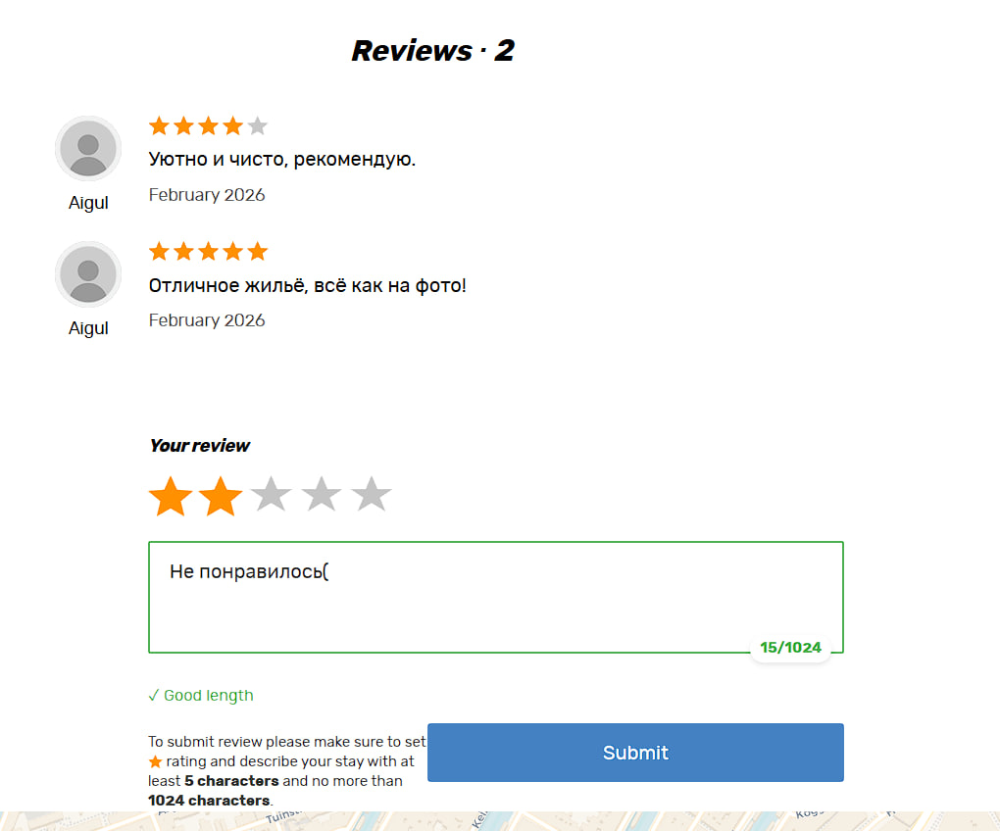
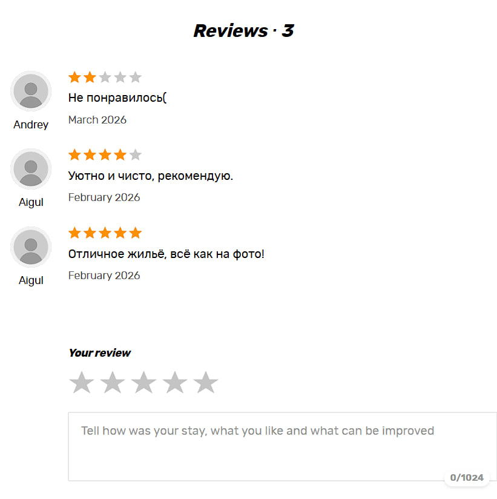
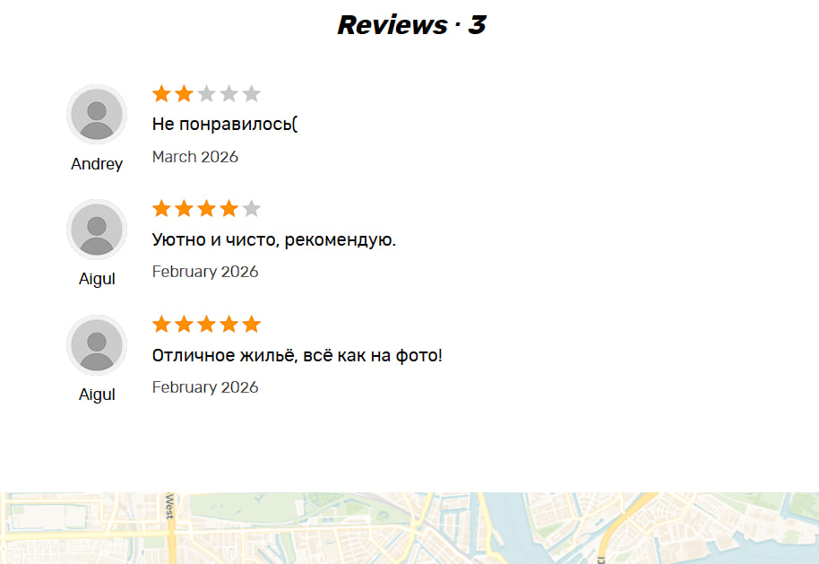
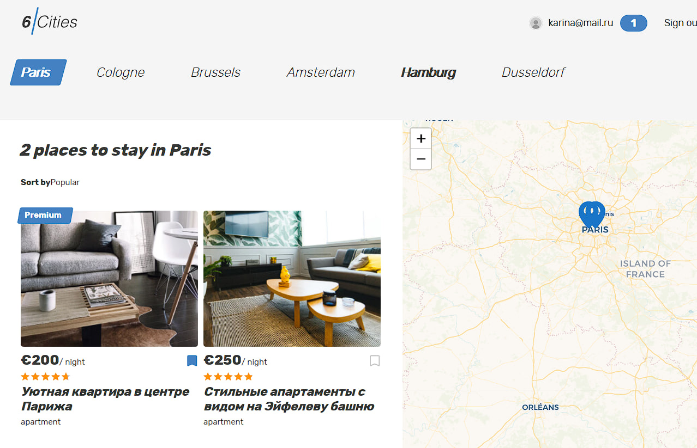
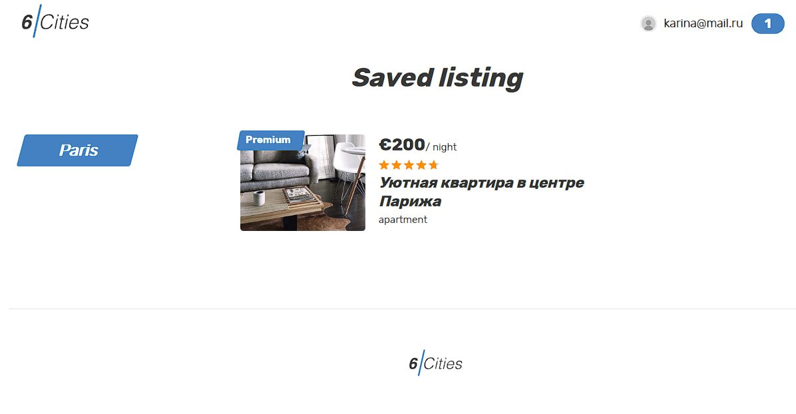

# Лабараторная работа 5
## Задание 1. Доработайте компонент главной страницы. Для гостей в шапке страницы отображается ссылка для перехода на страницу ввода логина и пароля. Для авторизованных пользователей — информация о пользователе (смотри пример в макете) и кнопка для выхода.

## Задание 2. Напишите всю необходимую логику для получения информации по одному предложению об аренде на странице «Offer». 

## Задание 3. Предусмотрите ситуацию, когда пользователь пытается получить информацию о несуществующем предложении по аренде. 

## Задание 4. Напишите всю необходимую логику для отправки комментария на сервер. 

## Задание 5. Форма должна отображаться только для авторизованных пользователей.

## Задание 6. Необходимо реализовать переход на страницу Избранное и корректное ее отображение. 

