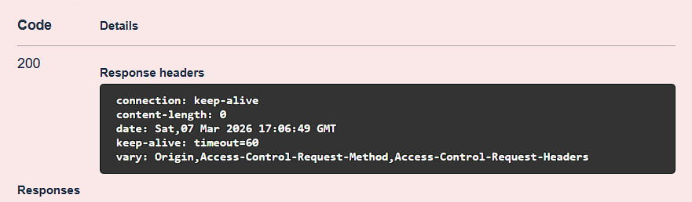
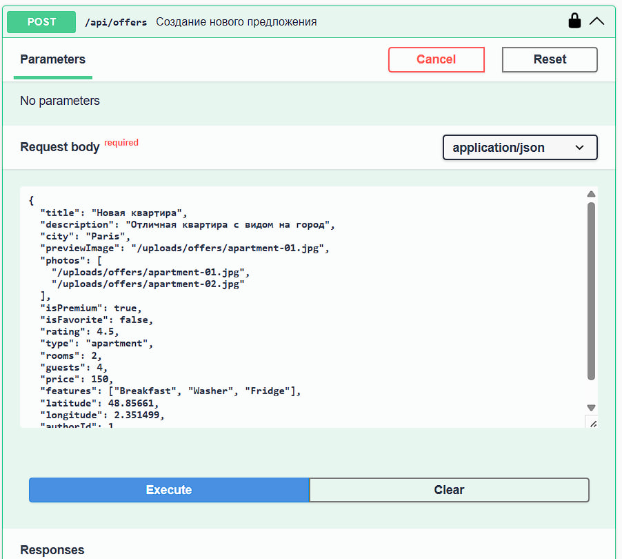
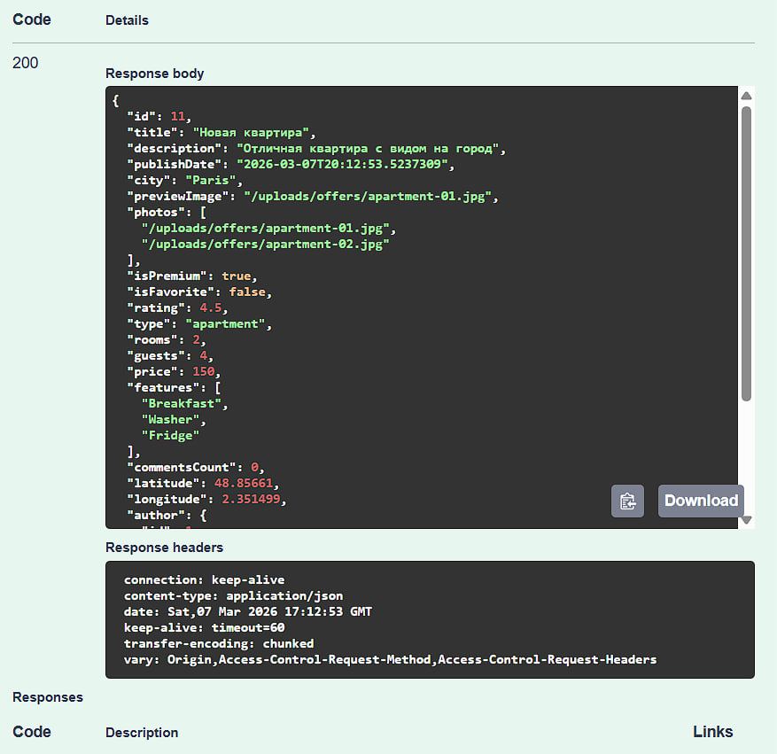
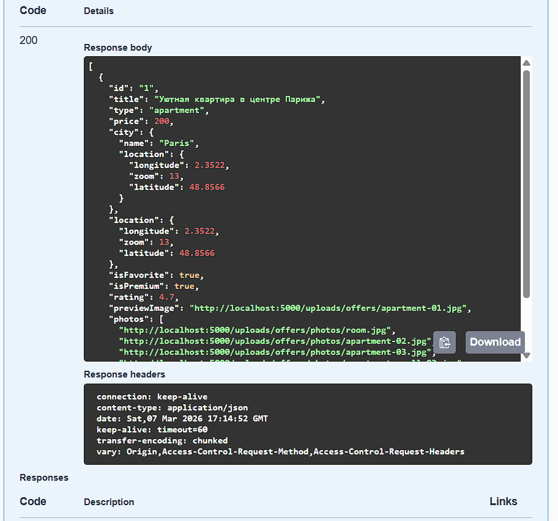
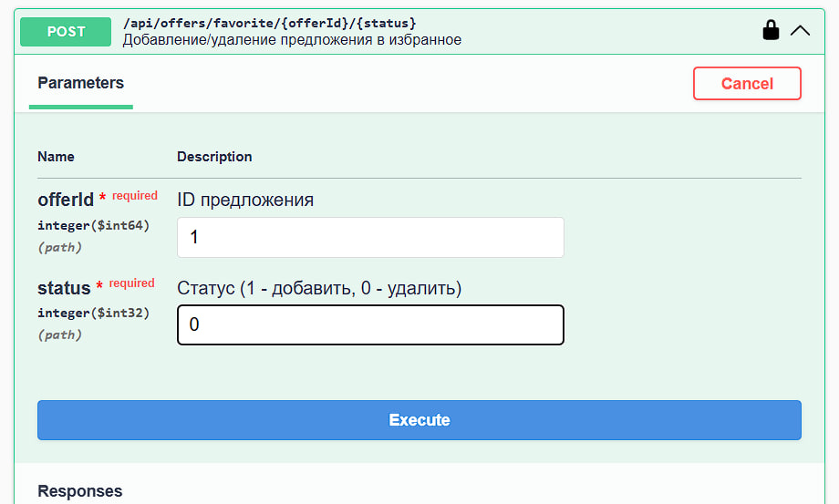
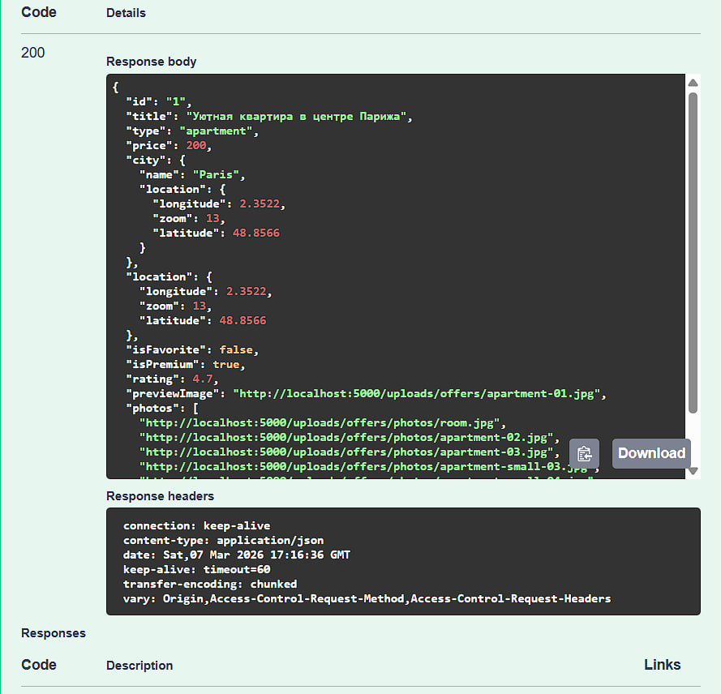
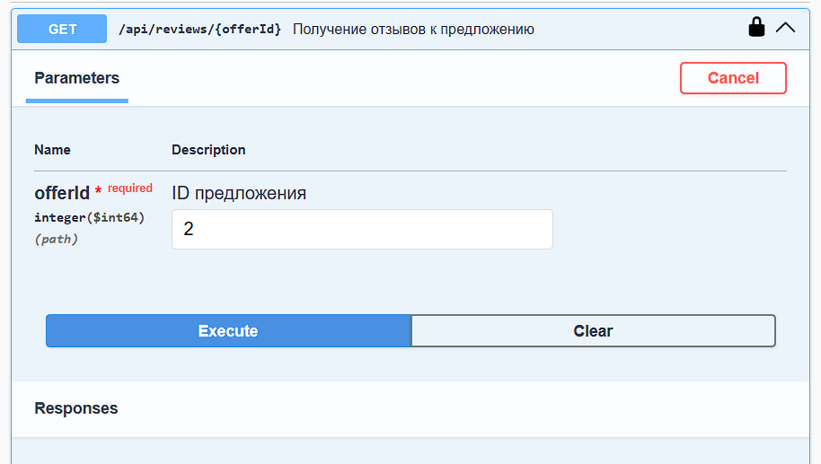
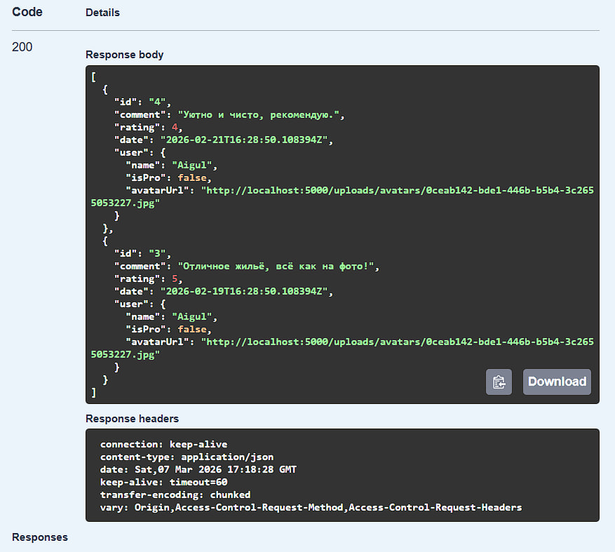
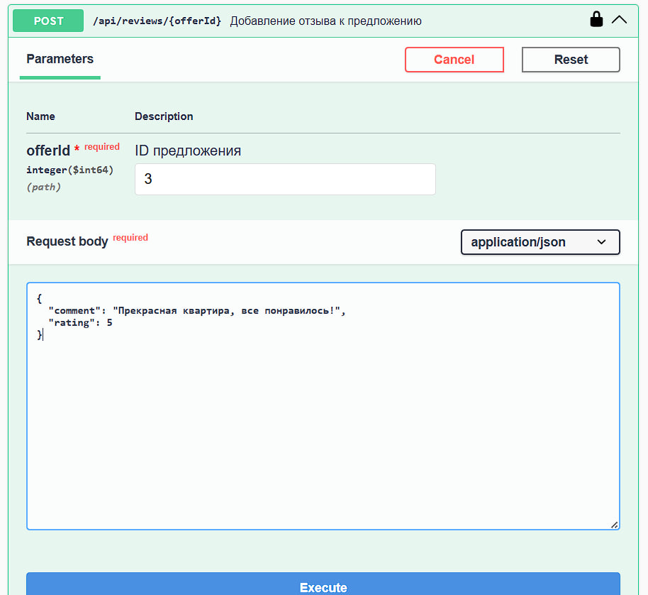
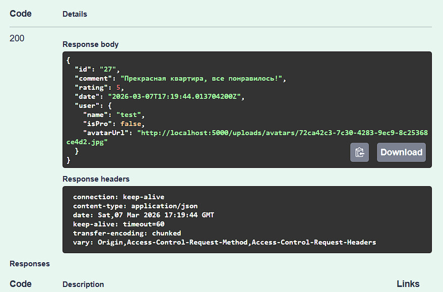

# Лабараторная работа 6
## POST /api/auth/login - Вход

## POST /api/auth/register - Регистрация

## GET /api/auth/login - Проверка авторизации

## DELETE /api/auth/logout - Выход 

## GET /api/offers - Все предложения

## GET /api/offers/{id} - Детали предложения

## POST /api/offers - Создание предложения

## GET /api/offers/favorite - Избранные предложения

## POST /api/offers/favorite/{offerId}/{status} - Переключение избранного

## GET /api/reviews/{offerId} - Отзывы к предложению

## POST /api/reviews/{offerId} - Добавление отзыва

